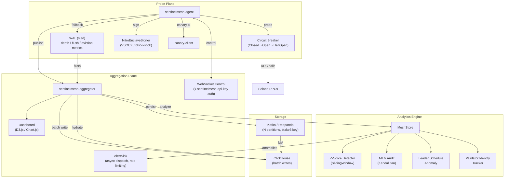

# Architecture

SentinelMesh is split into a probe plane, an aggregation plane, and an analytics engine — backed by a durable storage tier.



## Probe Plane

`sentinelmesh-agent` fans out requests to multiple Solana endpoints in parallel and captures:

- health
- slot
- block height
- latest blockhash
- version
- validator identity
- vote accounts
- cluster nodes
- leader schedule
- tracked accounts
- tracked transaction signatures

Agents may also emit canary transactions using the `solana` CLI. Fresh canary signatures are fed back into the tracking set so the next probe cycle measures propagation windows without relying on a static signature list.

Each probe cycle emits a `ProbeBatch`. Batches can be wrapped in a signed `ProbeEnvelope` using Ed25519. The signer is identified by `signer_id` and `key_id`, allowing key rotation without changing the sentinel identity.

To support **Proof of Origin**, cryptographic signing has been abstracted securely via the `SignerBackend` trait. Enterprise nodes can leverage **AWS Nitro Enclaves** (`NitroEnclaveSigner` via VSOCK) to sign batches in hardware-isolated CVMs without ever exposing private keys to the host memory.

The `NitroEnclaveSigner` communicates with the enclave over a VSOCK channel using `tokio-vsock`. The protocol sends a length-prefixed frame (`[4 bytes length][signer_id:key_id:batch_hash]`) and receives 64 raw Ed25519 signature bytes. Both connect and read operations enforce a 5-second timeout. On failure (timeout, connection refused, or invalid response), the signer returns a descriptive error without panicking.

### Circuit Breaker

Each RPC endpoint is wrapped by a `CircuitBreaker` state machine that prevents wasting probe cycles on unhealthy endpoints:

```
Closed ──(failure_threshold consecutive failures)──▶ Open
Open   ──(recovery_interval elapsed)──▶ HalfOpen
HalfOpen ──(probe success)──▶ Closed
HalfOpen ──(probe failure)──▶ Open
```

Configuration defaults: `failure_threshold = 3`, `recovery_interval = 60s`. The `CircuitBreakerRegistry` is a `HashMap<String, EndpointCircuit>` behind a `parking_lot::RwLock`, consulted in `collect_observations()` before each probe.

When all endpoints are in `Open` state (total blackout), the Agent ignores the circuit breaker and probes every endpoint to avoid complete observability loss.

Prometheus metrics: `sentinelmesh_agent_circuit_breaker_state` gauge per endpoint (0 = closed, 1 = open, 2 = half_open).

### Resilience and Auto-Healing
If the Aggregator cannot be reached, the Agent fails over to a local zero-dependency **WAL (Write-Ahead Log)** powered by `sled`. A dedicated background `Flusher` thread retries dispatching rested batches with exponential backoff. The WAL employs a **Ring Buffer Eviction Policy** (`max_entries = 10_000`) preventing zero-day disk exhaustion during permanent network partitions.

The WAL exposes Prometheus metrics for operational visibility:

- `sentinelmesh_agent_wal_depth` (gauge) — current queue depth, reported every probe cycle
- `sentinelmesh_agent_wal_flush_latency_ms` (histogram) — time taken per flush attempt
- `sentinelmesh_agent_wal_evictions_total` (counter) — incremented on each ring-buffer eviction

### Canary DEX Smart Contract Protocol 
For deterministic MEV and Censorship Resistance auditing, agents can invoke the native `sentinelmesh-canary-client`. It interacts securely with a dedicated Solana smart contract targeting intensive Compute Unit burn (~200k CUs) to force validators to reveal true block inclusion priorities over dummy transfers. Executions are highly sanitized to prevent Command Injection.

## Aggregation Plane

`sentinelmesh-aggregator` receives probe envelopes through `POST /v1/ingest`.

Processing pipeline:

1. Request auth is checked using API keys and optional signed-envelope verification.
2. The envelope is appended to the local replay log.
3. The batch is persisted to Kafka/Redpanda (partitioned by `sentinel_id`).
4. Endpoint samples are batch-written to ClickHouse.
5. The in-memory analytics window is updated or rebuilt from durable storage.

The aggregator is intentionally designed to be horizontally scalable:

- durability lives in Kafka/Redpanda plus ClickHouse
- aggregation nodes can rehydrate from storage
- no local in-memory state is required for correctness

### Control Plane (WebSocket Topology)
The Aggregator exposes a secured, authenticated (`/v1/ws/control`) WebSocket endpoint. Agents connect in real-time, allowing the centralized platform to dynamically broadcast RPC Endpoints updates globally. 
The mesh is protected from **TCP Half-Open (Zombie) Connections** through forced 30-second asynchronous **Ping/Pong** heartbeats. Administrative broadcasts (`/v1/admin/broadcast`) are tightly shielded against Remote Fleet Hijacking by strictly requiring `x-sentinelmesh-api-key` headers.

WebSocket connections are authenticated before the HTTP upgrade. The Aggregator extracts a token from the `x-sentinelmesh-api-key` header or the `token` query parameter and validates it against the configured `api_keys` list. Invalid or missing tokens are rejected with HTTP 401 before the WebSocket handshake completes. Every connection attempt is logged with its authentication result.

### Async Alert Dispatch

The `AlertSink` decouples anomaly dispatch from the analysis loop via a bounded async channel:

- Anomalies are sent to a background task via `tokio::sync::mpsc`.
- When the channel is full, the oldest anomalies are dropped (backpressure) — the producer never blocks.
- Rate limiting is applied per anomaly code with a configurable window (default 15 minutes). Duplicate anomaly codes within the window are suppressed.
- Webhook calls enforce a 10-second timeout; timeouts are logged and the sink moves on.

### Adaptive Backoff

The `refresh_from_storage_loop` uses an `AdaptiveRefresh` strategy to avoid overloading ClickHouse during quiet periods:

- When the hydrated sample count is unchanged between two consecutive cycles, `refresh_interval` increases by 50%.
- The interval is capped at `max_refresh_interval` (default 60s).
- When a new `ProbeEnvelope` arrives via direct ingestion, the interval resets to the base value.
- The interval never drops below the configured base.
- Metric: `sentinelmesh_aggregator_refresh_interval_ms` (gauge).

### Kafka Multiple Partitions

The `StorageEngine` supports configurable Kafka partitions (`partitions`, default 1). Topics are created with the configured partition count. Records are routed deterministically using a blake3 hash of the `sentinel_id`:

```
partition = u32::from_be_bytes(blake3(sentinel_id)[0..4]) % num_partitions
```

This guarantees that all envelopes from the same sentinel land on the same partition, preserving per-sentinel ordering. Hydration reads from all partitions.

### ClickHouse Batch Writes

The `ClickHouseBatchWriter` accumulates `ProbeEnvelope` records in an internal buffer and flushes them in batch:

- Flush triggers: `buffer.len() >= batch_size` (default 100) **or** `batch_timeout` elapsed (default 5s) — whichever comes first.
- On insertion failure, records are retained in the buffer for retry on the next flush cycle.
- Prometheus metrics: `sentinelmesh_storage_batch_buffer_size`, `sentinelmesh_storage_batch_flush_latency_ms`, `sentinelmesh_storage_batch_flush_failures_total`.

## Analysis Model

`MeshStore` computes:

- RPC consistency index
- slot spread
- block height spread
- blockhash disagreement ratio
- account divergence count (using `state_hash` comparison)
- provider HHI
- ASN HHI
- propagation summary (p50, p95, p99)
- z-score report (statistical mode)
- MEV audit summary
- leader schedule anomalies
- anomaly list

The active view is derived from the freshest sample per `(sentinel_id, endpoint_id)` key within the configured freshness window.

### state_hash Divergence Detection

When multiple endpoints report different `state_hash` values for the same tracked account (pubkey), the `MeshStore` registers a divergence. Observations missing `state_hash` are excluded from the analysis. The `account_divergence_count` field in `NetworkSnapshot` reflects the number of accounts with variant hashes, and an `account_state_divergence` anomaly with severity `Warning` is generated.

### ASN HHI and Topological Concentration

The `asn_hhi` is calculated as the Herfindahl-Hirschman Index over the ASN distribution of active samples: `Σ(share_i²)` where `share_i = count_i / total_with_asn`. When no sample has an ASN field, `asn_hhi` defaults to `0.0`.

- `asn_hhi >= 0.50` → anomaly `asn_concentration` with severity `Warning`
- `asn_hhi >= 0.90` → "topological blindness" — RPC consistency anomalies are downgraded from `Critical` to `Warning`

### Z-Score Statistical Detection

The `SlidingWindow` maintains a rolling history (default 100 values) for each key metric (slot spread, block height spread, average latency, provider HHI). When `detection_mode = statistical` and the window contains ≥ 30 samples, anomalies are generated based on z-score:

- |z| ≥ 3.0 → `Warning`
- |z| ≥ 4.0 → `Critical`

When the window has fewer than 30 samples or the standard deviation is near zero, the system falls back to fixed-threshold detection. The `NetworkSnapshot` includes an optional `ZScoreReport` with per-metric z-scores.

### MEV Audit

The MEV audit module compares transaction ordering across endpoints for the same slot. Concordance is measured using the normalized Kendall tau distance:

```
concordance = 1 - (tau_distance / max_distance)
```

When concordance for a slot drops below 0.80, an `mev_reordering_suspected` anomaly with severity `Warning` is generated. Slots without transaction data or with a single endpoint are silently skipped. The `NetworkSnapshot` includes an `MevAuditSummary` with `slots_analyzed` and `slots_with_reordering`.

### Leader Schedule Anomaly Detection

The `MeshStore` compares `LeaderScheduleObservation` across endpoints for the same epoch:

- Divergent schedules → anomaly `leader_schedule_divergence` with severity `Warning`
- A single validator holding > 10% of leadership slots → anomaly `leader_concentration` with severity `Info`

### Validator Identity Tracking

The `ValidatorIdentityTracker` maintains a `BTreeMap<String, Vec<IdentityChangeEvent>>` keyed by endpoint ID. On each `ingest()`, the current identity is compared with the last known identity. Changes produce an `IdentityChangeEvent` (timestamp, previous identity, new identity) and a `validator_identity_change` anomaly with severity `Info`.

The full history is exposed via `GET /v1/validator-history`.

### Propagation Percentiles

`summarize_propagation()` computes p50, p95, and p99 of signature propagation windows using the nearest-rank method. All three percentiles are included in `PropagationSummary` (`p50_window_ms`, `p95_window_ms`, `p99_window_ms`). When no tracked signature has propagation data, all percentiles return `None`.

### Command Center (Dashboard)
All analytical telemetry is served through a **Vanilla JS/CSS Cyberpunk-themed Dashboard** (`/`) hosted natively by the Aggregator. It leverages **Glassmorphism**, Chart.js CDN for visual Provider HHI Distribution (Doughnut charts), and a fully reactive table with real-time glowing health status indicators synced silently without FOUC (Flash of Unstyled Content).

The dashboard includes:

- **Network topology visualization** (D3.js/vis.js) — Agents → RPC Endpoints with health status
- **Geographic concentration map** — based on `sentinel_location` and endpoint `region`
- **Anomaly timeline** — filterable by severity and anomaly code
- **Propagation percentile time series** (Chart.js) — p50, p95, p99 over time
- **Provider HHI and ASN HHI doughnut charts** — separate charts for infrastructure and topological concentration
- **Auto-refresh** — `setInterval` every 10 seconds polling `/v1/snapshot`

## Transport and Security

- Ed25519 signed envelopes protect integrity at the application layer
- the aggregator can terminate TLS and require client certificates natively
- API keys provide simple bootstrap auth
- WebSocket control plane requires `x-sentinelmesh-api-key` or `token` query param (HTTP 401 on failure)
- client TLS hooks allow agents to present certificates to an ingress or service mesh
- service-mesh mTLS manifests are provided in `deploy/istio`

## Failure Recovery

- duplicate batch ingest is safe due to idempotent keys
- replay log supports cold-start recovery
- Kafka/Redpanda plus ClickHouse serve as the durable source of truth
- ClickHouse batch writer retains records on flush failure for automatic retry
- circuit breaker prevents probe waste on unhealthy endpoints; blackout fallback ensures no total observability loss
- WAL eviction metrics and depth gauges provide early warning of backlog issues

## Testing Infrastructure

SentinelMesh employs a three-tier testing strategy: integration, load, and chaos.

### Integration Tests (`tests/integration/`)

Rust-based integration tests using `#[tokio::test]` with mocks for external dependencies:

- **Mock RPC** — local HTTP server returning pre-defined JSON-RPC responses
- **Mock Kafka** — in-memory implementation of the produce/consume trait
- **Mock ClickHouse** — local HTTP server accepting queries and returning pre-defined data

Key scenarios:
1. Full flow: Agent collects probe → publishes to Aggregator → Aggregator persists and analyzes
2. WAL failover: Agent fails to publish → persists to WAL → flusher retries successfully
3. WebSocket control plane: Aggregator broadcasts endpoint update → Agent receives and applies
4. Authentication: rejection of batches without API key, rejection with invalid signature

All tests run via `cargo test --workspace` with no external dependencies.

### Load Tests (`tests/load/`)

k6 script (`ingest.js`) simulating concurrent Agents against `/v1/ingest`:

- Configurable via environment variables: `VUS`, `DURATION`, `BATCH_SIZE`
- Generates realistic `ProbeEnvelope` payloads with multiple endpoints, account and signature observations
- Reports throughput (envelopes/sec), latency p50/p95/p99, and error rate
- Threshold: p99 < 500ms with 50 simultaneous VUs

### Chaos Tests (`tests/chaos/`)

Automated fault-injection scenarios using Toxiproxy (or `tc`/`iptables`):

| Scenario | Validates |
|---|---|
| Latency and packet loss Agent↔Aggregator | WAL capture and flusher retry |
| RPC endpoint unavailability | Circuit breaker activation and concentration metrics |
| Aggregator restart | State reconstruction from ClickHouse |
| Kafka network partition | Batch buffer retention |

Each scenario produces a report with pass/fail result and observed metrics.
